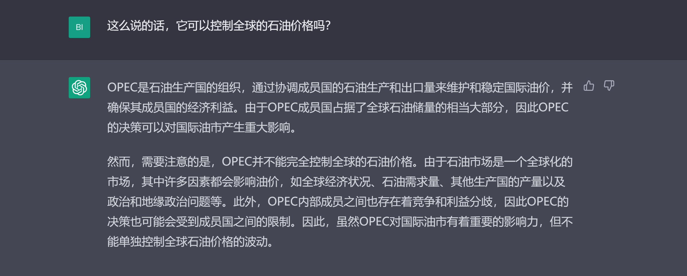
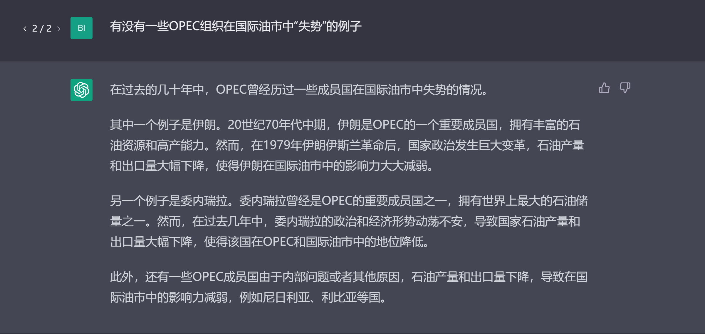
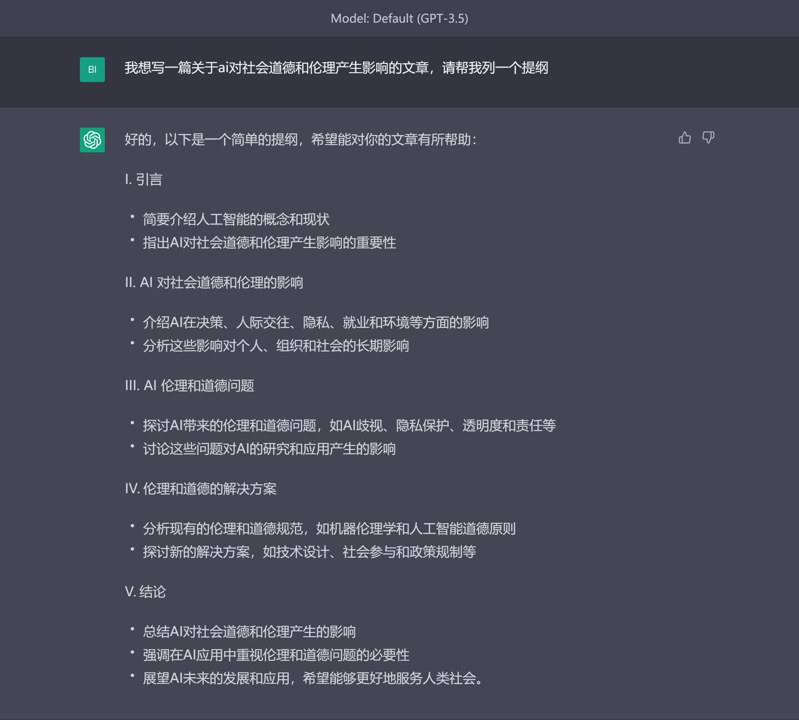
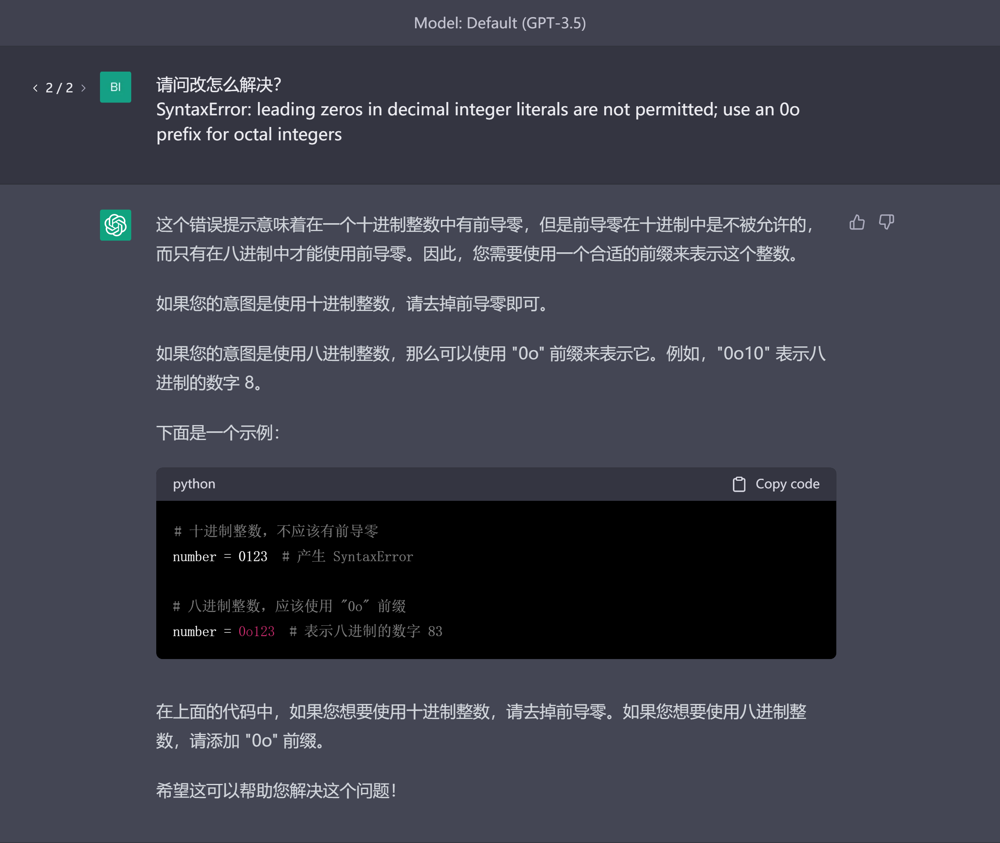
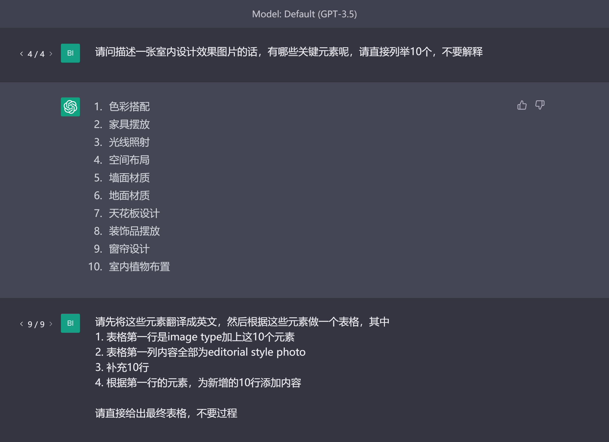
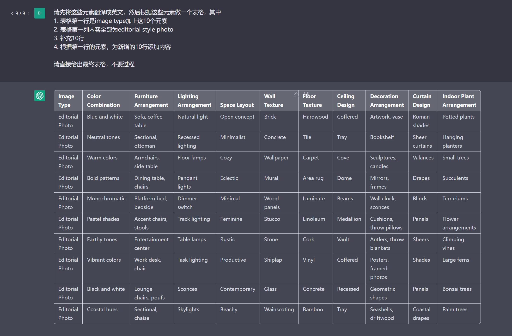
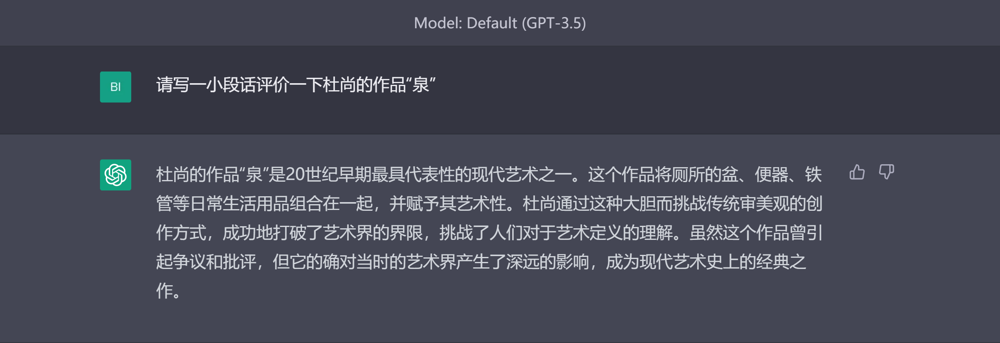
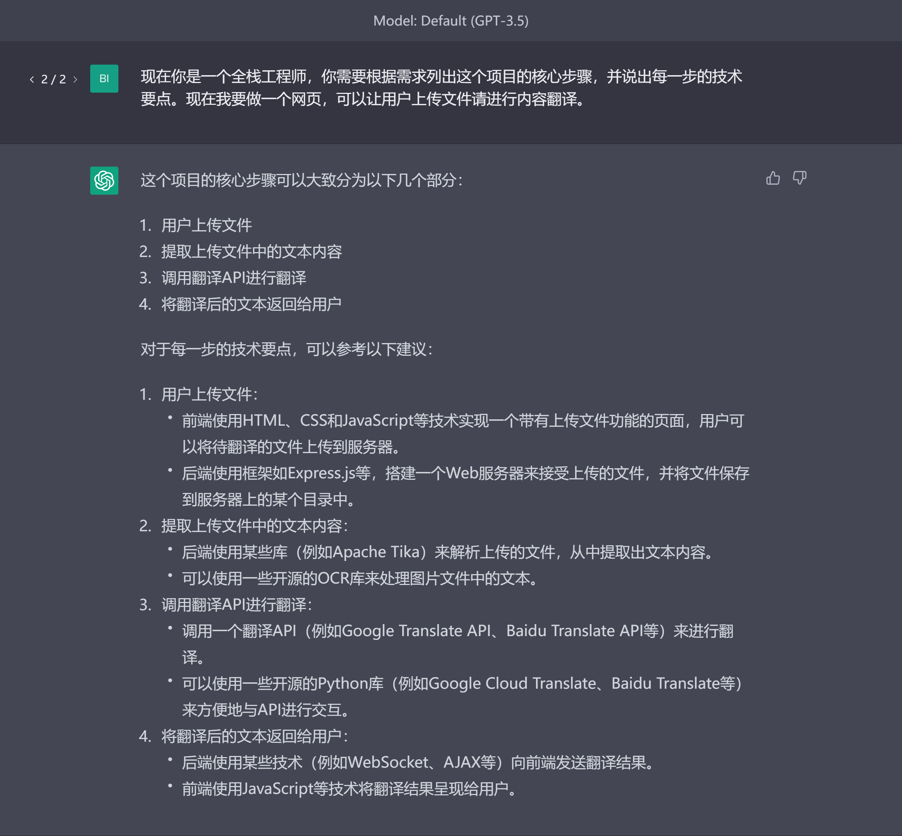
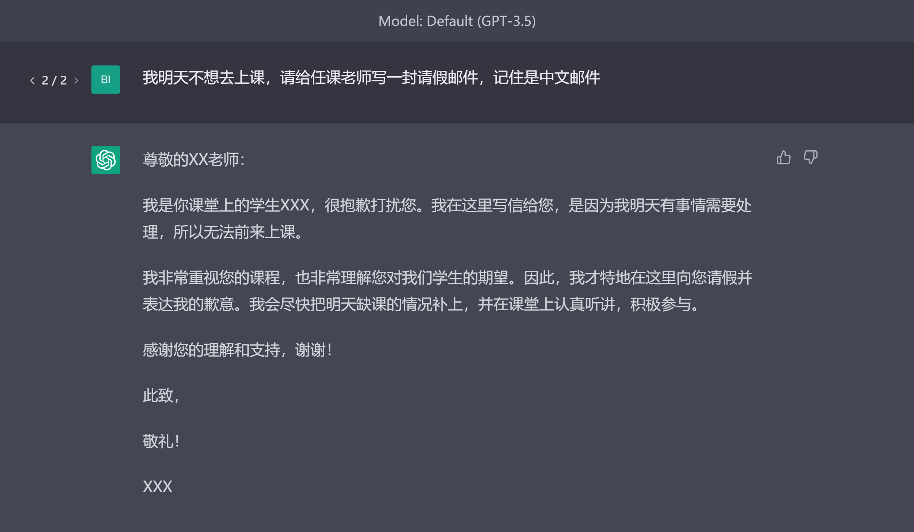
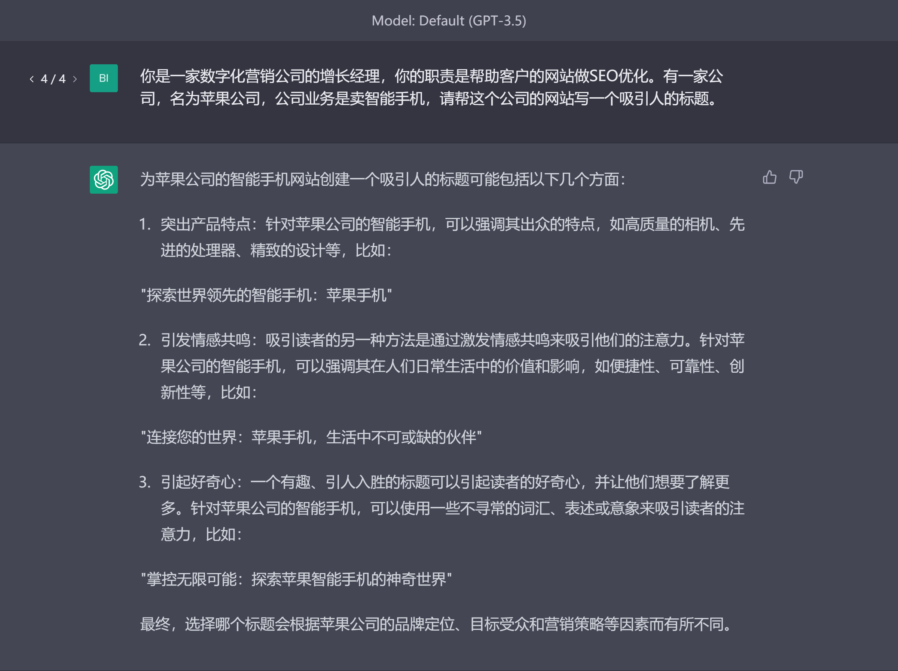

# 入门应用 

在这一章节，我们将分类举例典型的应用场景和其中的使用技巧。

本章内容：
1. [直接问答](#直接问答)
2. [文字处理](#文字处理)
   - 翻译
   - 扩写与改写
   - 总结与问答
   - 提纲与文段生成
3. [代码处理](#代码处理)
   - 代码生成
   - 代码解释与注释
   - 报错答疑
4. [图片提示词生成（image prompt）](#图片提示词生成)
5. [角色扮演](#角色扮演)
6. [常用案例](#常用案例)

## 直接问答
直接问答是ChatGPT最常见的使用方式，ChatGPT是一个聊天机器人，会根据用户的问题进行回答，还会保留对之前对话的记忆。询问ChatGPT问题并在对话中使用提示词技巧不断对ChatGPT进行引导是使用ChatGPT最好的方式。

我们可以先直接对chatGPT进行一个提问，

由于chatGPT具有记忆上下文对话的能力，我们可以接着进行提问，

可以看出chatGPT能识别出问题中的“它”指的是我们第一次提问中所指的OPEC。我们可以针对OPEC继续提问，

不难看出，我们可以在对话中不断地针对某个问题、某个领域深入提问。刚开始使用chatGPT时，我们可以将chatGPT暂时当作一个无所不知的人，和他的对话方式就像和一个正常人进行沟通交流。有时与chatGPT的对话，其实也是在高效地不断地刷新扩展个人知识库的过程。

另外，在向ChatGPT提问时需要注意，告诉ChatGPT要做什么比不要做什么更有效[[1]](#https://help.openai.com/en/articles/6654000-best-practices-for-prompt-engineering-with-openai-api)，这是来自OpenAI官方的建议。

## 文字处理
除了简单的直接问答，我们也可以让chatGPT帮我们进行许多文字方面的处理工作。
### 翻译
最常见的应用之一就是翻译。传统的翻译工具我们需要将文本黏贴在指定框格中然后选择目标语言，在chatGPT中我们需要做的是“和它说我们需要翻译什么”，如果我们输入中文prompt+英文内容，一般情况下chatGPT就会返回中文；相反，如果输入prompt+中文内容，chatGPT就会返回英文，

当然，我们也可以直接输入具体的prompt。同时，你会发现上面的中文翻译结果有点生硬，我们可以提示chatGPT，翻译需要自然一点

### 扩写与改写
某些情况下，我们需要将一个句子的内容扩展得更加丰富，此时可以让chatGPT扩写，

除了扩写，我们也可以改写，在保留文本原意的基础上进行转述，

### 总结与问答
在某些阅读的时候，由于文本过长，而我们想快速了解文本的主要内容，此时可以使用chatGPT帮我们进行总结与提炼（下面例子原文过长，已裁去，可以点击查看[原文](#https://baijiahao.baidu.com/s?id=1761886603048134863&wfr=spider&for=pc)），

同时，我们也可以针对输入的文本内容，对chatGPT进行提问。

上述方法可以在许多使用场景提高我们的效率，比如paper阅读，专业报告阅读等等。
### 提纲与文段生成
最常见的情况是你想写一篇文章，告诉chatGPT你想写的主题内容，然后生成相应的提纲，

提纲生成之后，自然而然的我们可以根据提纲来生成具体的内容，比如提纲中的其中一点，

除了文章的提纲和文段生成，我们也可以将chatGPT应用在演讲稿、计划书等等文字任务上。

## 代码处理
代码相关的任务处理力也是chatGPT非常重要和表现出色的能力，它不仅可以帮助开发人员极大地提高开发效率，也可以帮助未接触过编程的用户学习编程。我们先从开发者的角度来使用chatGPT。
### 代码生成
我们可以直接告诉chatGPT想实现的功能，并指定编程语言让它生成，同时也可以加上指定的包（Package）和类（class），

可以看到chatGPT不仅帮我们生成了代码，而且还有注释以及使用方法，非常适合实际的应用。
### 代码解释与注释
如果我们想使用别人的代码块，但是却不明白其具体的实现逻辑，可以将代码粘贴到对话框，

如果想在代码里面加上注释，此时也可以使用chatGPT，

正如chatGPT结尾所说，“希望这些注释可以更好地帮助你理解代码的含义和作用”。
### 报错答疑
在运行代码时如果出现了错误，我们可以直接将报错信息粘贴到chatGPT以了解错误出错的可能，chatGPT也会告诉你可能的解决方法，

这里有另外一种实用的使用方法，当chatGPT生成的代码在运行时出现了错误，我们可以将报错信息在同一个对话中接着给到chatGPT，它会解释错误并且重新帮我们生成代码。
## 图片提示词生成
与chatGPT一同流行起来的还有众多图片生成工具，用户只需要输入文本，这些工具/服务就可以生成图片，即text to image。

所以直接影响生成图片质量的便是用户输入的文本/提示词，这里的提示词也称作prompt，为了与给chatGPT的prompt作出区分，这里我们将生成图片的提示词称作图片提示词（image prompt）。

之后会有一个章节专门来讲解image prompt的使用方法和技巧。在这部分我们更偏重的是如何利用chatGPT提高我们生成image prompt的效率。

如果我们想要生成室内设计效果图的图片[[2]](https://twitter.com/nickfloats/status/1635116674616791040?ref_src=twsrc%5Etfw%7Ctwcamp%5Etweetembed%7Ctwterm%5E1635116676978208769%7Ctwgr%5E310417aab2231e5a23cdcb566b080a4ca2481cc4%7Ctwcon%5Es2_&ref_url=https%3A%2F%2Fweirdwonderfulai.art%2Fgeneral%2Fusing-chatgpt-to-create-prompts-for-ai-art%2F)，但是不知道image prompt该从何写起，我们可以先让chatGPT拆解图片中的元素，

然后生成一个表格，这个头脑风暴式的表格可以给我们很多的参考组合，
剩下需要做的就是将这些词语组合到一起形成image prompt，交给Midjourney或者stable diffusion生成图片了。当然，我们也可以继续让chatGPT从表格中直接批量生成image prompt。

下面是Midjourney根据
>Editorial style photo, Coastal hues, Sectional, chaise, Skylights, Beachy, Wainscoting, Bamboo, Tray, Seashells, driftwood, Coastal drapes, Palm trees --ar 16:9

生成的图片。

## 角色扮演
“角色扮演”是使用chatGPT过程中十分重要的一个技巧，除了让chatGPT可以以某种特定身份的说话方式说话之外，还可以使输出的内容更具有专业性。

我们可以先让chatGPT回答一个问题，

接着，加上角色扮演，让它重新输出文本，

可以看到在有角色扮演的“加持”后，内容在“文风”和关注侧重点上都有所不同。

针对同一个问题，不同的角色扮演也会得到不同专业角度的回答，

所以在chatGPT的使用中，善用角色扮演，是迭代和提高答案质量的关键。

## 常用案例
除了前面列出的场景，还有一些ChatGPT被高频用到的场景，在这一节我们以这些场景为例，展示如何写出效果好的提示词。

### 写邮件
如果因为某些原因需要课程请假，可以写一封请假邮件，

这里的prompt专门提到了**中文邮件**，是因为在某些情况下chatGPT输出的内容是很明显的“英转中”的结果，比如邮件最后会带“诚挚的”，这是由英文中的“Sincerely”翻译而来的。

如果你觉得上述邮件不够具体，可以让chatGPT再修改一下。

### 头脑风暴
你是一个创业顾问，让我们一起头脑风暴、集思广益，想一些可行的创业idea，将你想到的点子创建一个列表，使用编号列表，想10个项目。

### 标题
你是一家数字化营销公司的增长经理，你的职责是帮助客户的网站做SEO优化。有一家公司，名为苹果公司，公司业务是卖智能手机，请帮这个公司的网站写一个吸引人的标题。

### 学习资料清单
有时我们想了解学习一个全新的领域，为了尽可能地少走弯路，我们可以让chatGPT推荐一些书籍或者视频等学习资料的清单。

### 入团申请书
为了提高工作效率，我们可以让chatGPT帮忙写一些申请书。

Reference:

1. [OpenAI official blog](https://help.openai.com/en/articles/6654000-best-practices-for-prompt-engineering-with-openai-api)
2. [tweet of Nick St. Pierre](https://twitter.com/nickfloats/status/1635116674616791040?ref_src=twsrc%5Etfw%7Ctwcamp%5Etweetembed%7Ctwterm%5E1635116676978208769%7Ctwgr%5E310417aab2231e5a23cdcb566b080a4ca2481cc4%7Ctwcon%5Es2_&ref_url=https%3A%2F%2Fweirdwonderfulai.art%2Fgeneral%2Fusing-chatgpt-to-create-prompts-for-ai-art%2F)

[上一章节（基础篇）](prompting-basics.md)

[下一章节（进阶篇）](prompting-advanced-techniques.md)
