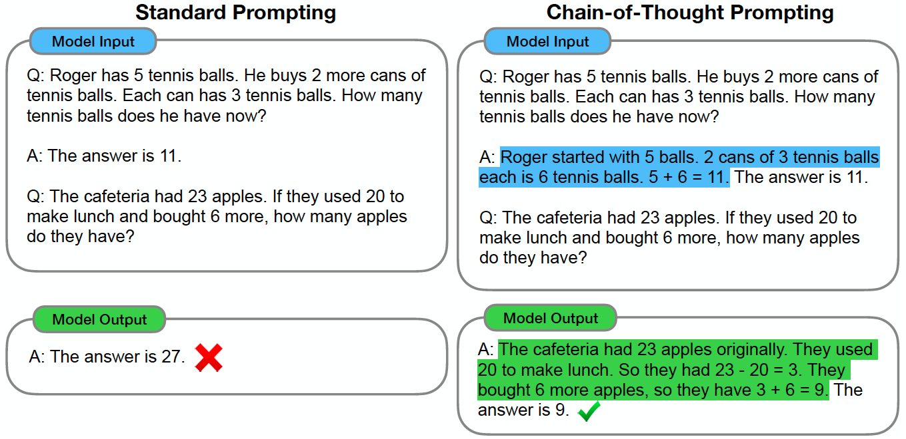

# Advanced Techniques

## Chain of Thought

Chain of Thought (CoT) refers to a coherent series of intermediate reasoning steps that lead to the final answer for a problem. Including chain-of-thought reasoning in the exemplars for few-shot prompting can significantly improve the ability of large language models to perform complex reasoning.

### Tasks and Performance

Experiments has shown that chain-of-thought prompting improves performance on a range of arithmetic, commonsense, and symbolic reasoning tasks.

#### Arithmetic Task

#### Commonsense Task

#### Symbolic Task

### Limitations

Chain-of-thought prompting is an emergent ability of model scale. That is, chain-of-though prompting does not positively impact performance for small models, and only yields performance gains when used with models of ~100B parameters.

## Zero Shot Chain of Thought

Zero Shot Chain of Thought (Zero-shot CoT) prompting[2] is a follow-up to CoT prompting. The authors found that LLMs become decent zero-shot reasoners by simply adding "Let’s think step by step" before each answer.

How does Zero-shot-CoT work

### Examples

### Results
Experimental results demonstrate that Zero-shot-CoT outperforms LLMs' zero-shot performances on diverse benchmark reasoning tasks, including arithmetic, symbolic reasoning, and other logical reasoning tasks.

### Limitation
LLMs have shown to capture and amplify biases found in the training data. Prompting is a method that looks to take advantage of the patterns captured by language models conducive to various tasks, and therefore it has the same shortcomings.

## Reference
1. Wei, J., Wang, X., Schuurmans, D., Bosma, M., Chi, E., Le, Q., & Zhou, D. (2022). Chain of thought prompting elicits reasoning in large language models. arXiv preprint arXiv:2201.11903.
2. Kojima, T., Gu, S. S., Reid, M., Matsuo, Y., & Iwasawa, Y. (2022). Large language models are zero-shot reasoners. arXiv preprint arXiv:2205.11916.

[Previous Section (Basic Application)](prompting-basic-applications.md)

[Next Section (Reliability)](prompting-reliability.md)
