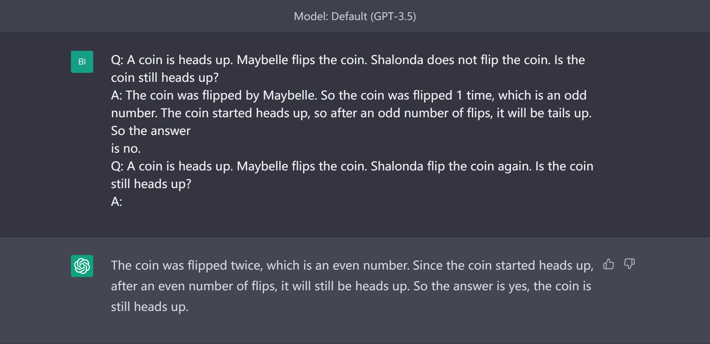

# 思维链
思维链（Chain of Thought, CoT）指的是导向最终答案的一系列连贯的中间推理步骤。在示例中引入思维链举例子可以显著改善大语言模型处理复杂推理任务的能力[1]。

## 任务和表现
实验表明思维链方法可以提升大语言模型在算数类、常识类、以及符号类任务的表现。

### 算数性任务

### 常识性任务

### 符号学任务

## 局限
思维链是模型参数量变大涌现出的能力，也就是说，思维链并不能提升小模型的能力，当模型有100B参数是，思维链提成模型性能的作用才显现出来。

## Reference
1. Wei, J., Wang, X., Schuurmans, D., Bosma, M., Chi, E., Le, Q., & Zhou, D. (2022). Chain of thought prompting elicits reasoning in large language models. arXiv preprint arXiv:2201.11903.