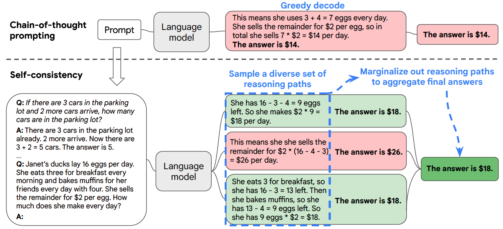

# 自洽性
自恰性是一种改进语言模型在复杂任务上的推理表现的解码策略[3]。它将思维链中运用的贪心解码策略换成了更多样和灵活的方法。

自恰性方法的灵感来自一个想法：复杂任务常常有多种解法，人们通过不同的推理路径都可以找到最终答案。与其只考虑可能性最大的路径，不如在样本中包括多种路径，然后选择最一致的答案。这个方法允许模型像人一样有更多样的推理方法，并显著提升模型在复杂任务上的表现。

下图展示了自洽行方法和思维链方法的不同：

## 示例

## 结果
与思维链相比，自恰性方法在算数类、常识类和符号类任务的众多基准上都有提升，包括GSM8K（+17.9%），SVAMP（+11.0%），AQuA（+12.2%），StrategyQA（+6.4%）以及ARC-challenge（+3.9%）。

## 局限
自恰性的一个局限是它带来了更多的计算成本。在实际使用中，可以少量尝试几条路径（比如5条或者10条）来获取这一方法带来的好处，同时不会产生太多成本，因为在大多数情况下性能提升很快会放缓。

## Reference
1. Wang, X., Wei, J., Schuurmans, D., Le, Q., Chi, E., & Zhou, D. (2022). Self-consistency improves chain of thought reasoning in language models. arXiv preprint arXiv:2203.11171.