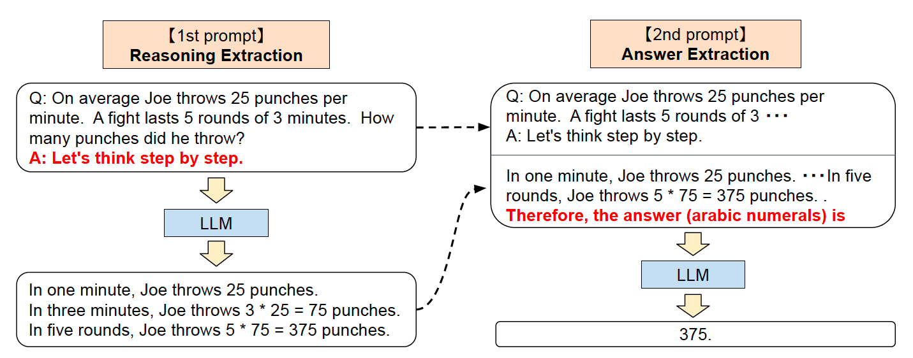
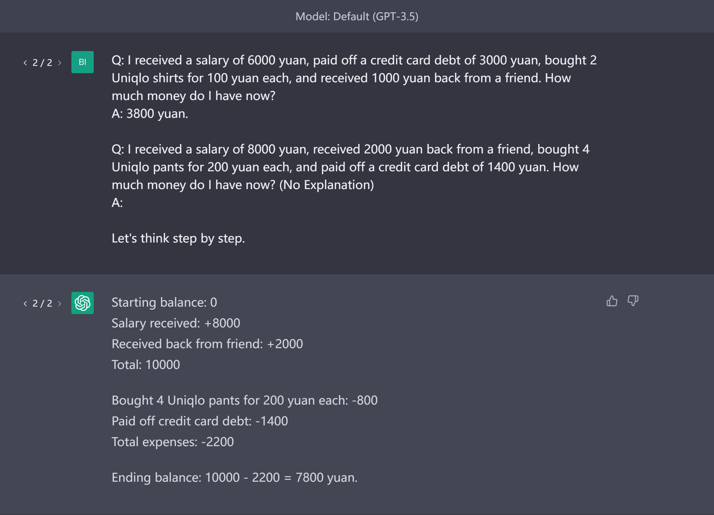

# 零样本思维链
零样本思维链（Zero-shot CoT）是在思维链方法的基础上展开的。研究者们仅仅是在提示词中加入“让我们一步一步的思考”（Let's think step by step），也能大幅提升大语言模型的能力。

零样本思维链的原理

## 示例

## 局限
研究者发现大语言模型会捕捉并放大训练数据中的偏差（Bias）。提示词是一种旨在利用语言模型在训练中学到的知识解决各类任务的方法，因此它也具有相同的缺点，会导致偏差。

## Reference
1. Kojima, T., Gu, S. S., Reid, M., Matsuo, Y., & Iwasawa, Y. (2022). Large language models are zero-shot reasoners. arXiv preprint arXiv:2205.11916.