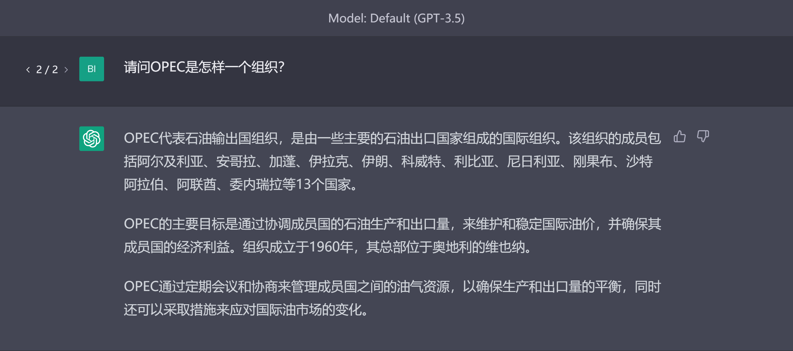
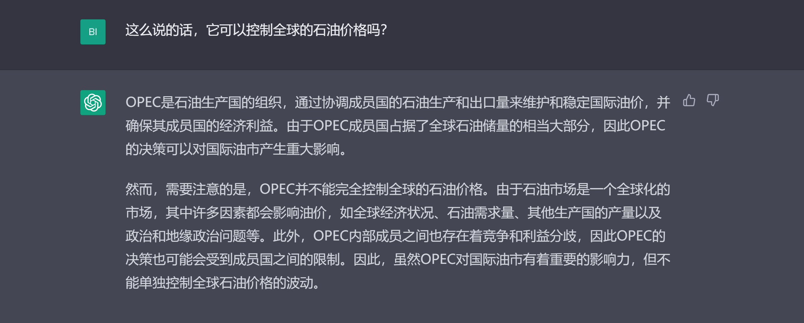
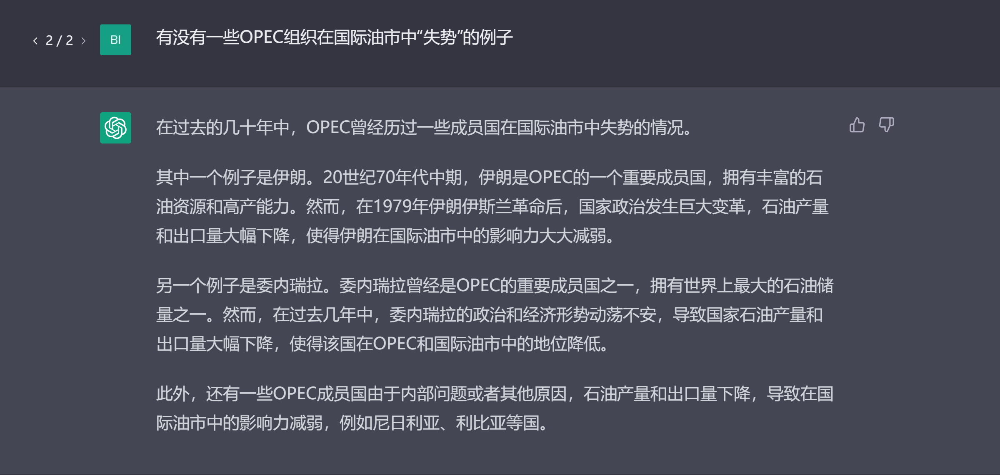

# 直接问答
直接问答是ChatGPT最常见的使用方式，ChatGPT是一个聊天机器人，会根据用户的问题进行回答，还会保留对之前对话的记忆。询问ChatGPT问题并在对话中使用提示词技巧不断对ChatGPT进行引导是使用ChatGPT最好的方式。

我们可以先直接对chatGPT进行一个提问，

由于chatGPT具有记忆上下文对话的能力，我们可以接着进行提问，

可以看出chatGPT能识别出问题中的“它”指的是我们第一次提问中所指的OPEC。我们可以针对OPEC继续提问，

不难看出，我们可以在对话中不断地针对某个问题、某个领域深入提问。刚开始使用chatGPT时，我们可以将chatGPT暂时当作一个无所不知的人，和他的对话方式就像和一个正常人进行沟通交流。有时与chatGPT的对话，其实也是在高效地不断地刷新扩展个人知识库的过程。

另外，在向ChatGPT提问时需要注意，告诉ChatGPT要做什么比不要做什么更有效[[1]](#https://help.openai.com/en/articles/6654000-best-practices-for-prompt-engineering-with-openai-api)，这是来自OpenAI官方的建议。

Reference:
1. [OpenAI official blog](https://help.openai.com/en/articles/6654000-best-practices-for-prompt-engineering-with-openai-api)