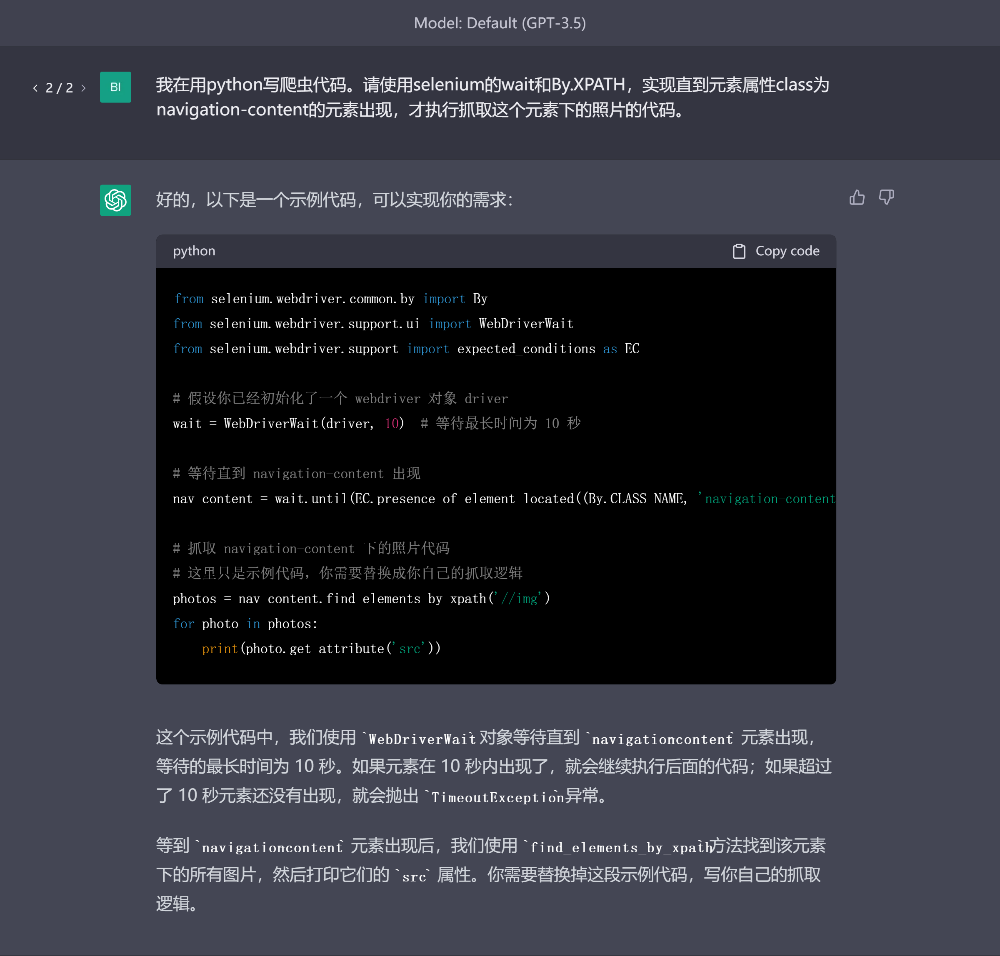
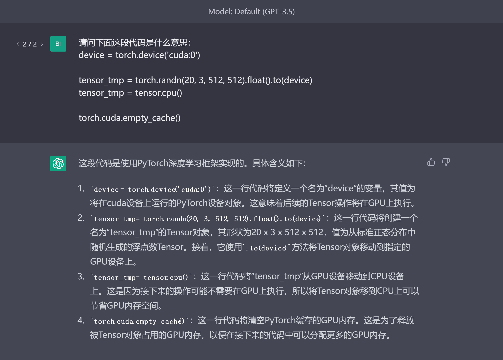
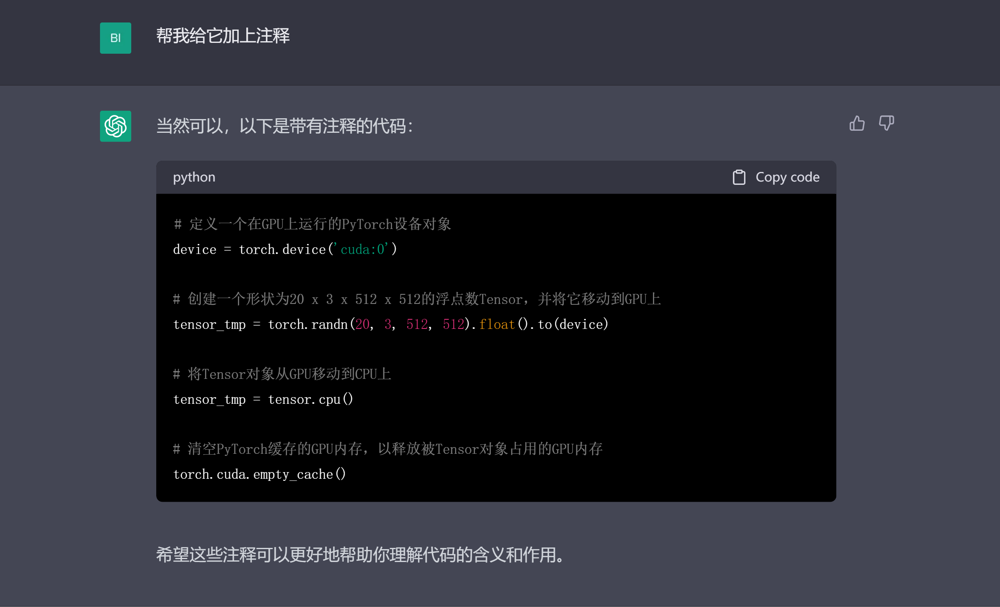
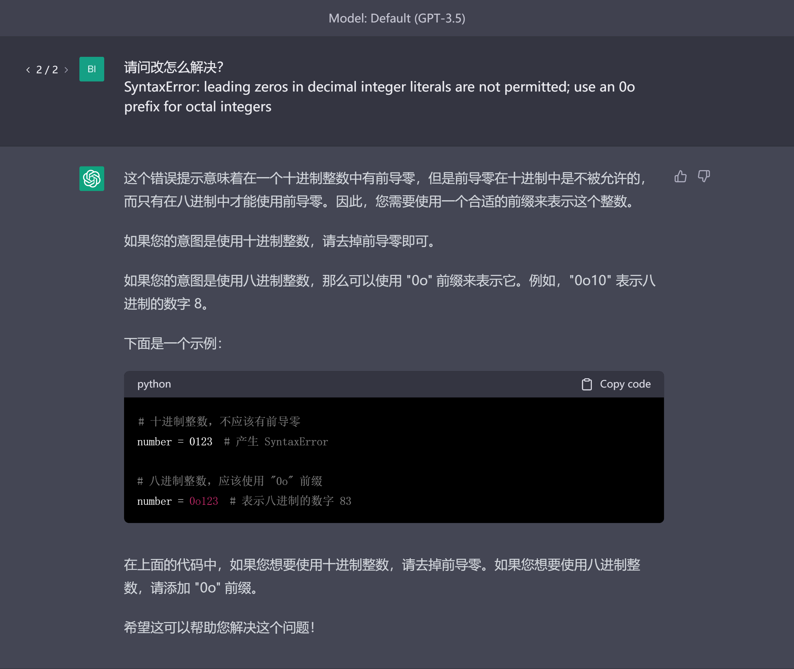

# 代码处理
代码相关的任务处理力也是chatGPT非常重要和表现出色的能力，它不仅可以帮助开发人员极大地提高开发效率，也可以帮助未接触过编程的用户学习编程。我们先从开发者的角度来使用chatGPT。
## 代码生成
我们可以直接告诉chatGPT想实现的功能，并指定编程语言让它生成，同时也可以加上指定的包（Package）和类（class），

可以看到chatGPT不仅帮我们生成了代码，而且还有注释以及使用方法，非常适合实际的应用。
## 代码解释与注释
如果我们想使用别人的代码块，但是却不明白其具体的实现逻辑，可以将代码粘贴到对话框，

如果想在代码里面加上注释，此时也可以使用chatGPT，

正如chatGPT结尾所说，“希望这些注释可以更好地帮助你理解代码的含义和作用”。
## 报错答疑
在运行代码时如果出现了错误，我们可以直接将报错信息粘贴到chatGPT以了解错误出错的可能，chatGPT也会告诉你可能的解决方法，

这里有另外一种实用的使用方法，当chatGPT生成的代码在运行时出现了错误，我们可以将报错信息在同一个对话中接着给到chatGPT，它会解释错误并且重新帮我们生成代码。