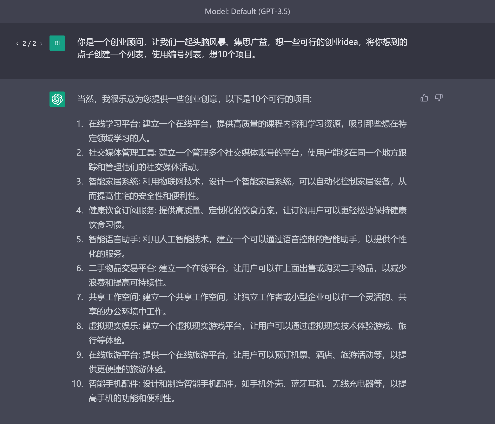

# 常用案例
除了前面列出的场景，还有一些ChatGPT被高频用到的场景，在这一节我们以这些场景为例，展示如何写出效果好的提示词。

## 写邮件
如果因为某些原因需要课程请假，可以写一封请假邮件，

这里的prompt专门提到了**中文邮件**，是因为在某些情况下chatGPT输出的内容是很明显的“英转中”的结果，比如邮件最后会带“诚挚的”，这是由英文中的“Sincerely”翻译而来的。

如果你觉得上述邮件不够具体，可以让chatGPT再修改一下。

## 头脑风暴
你是一个创业顾问，让我们一起头脑风暴、集思广益，想一些可行的创业idea，将你想到的点子创建一个列表，使用编号列表，想10个项目。

## 标题
你是一家数字化营销公司的增长经理，你的职责是帮助客户的网站做SEO优化。有一家公司，名为苹果公司，公司业务是卖智能手机，请帮这个公司的网站写一个吸引人的标题。

## 学习资料清单
有时我们想了解学习一个全新的领域，为了尽可能地少走弯路，我们可以让chatGPT推荐一些书籍或者视频等学习资料的清单。

## 入团申请书
为了提高工作效率，我们可以让chatGPT帮忙写一些申请书。
