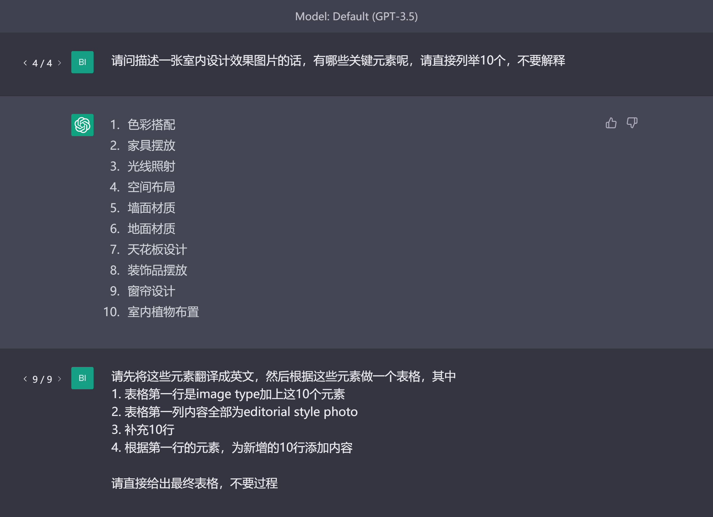
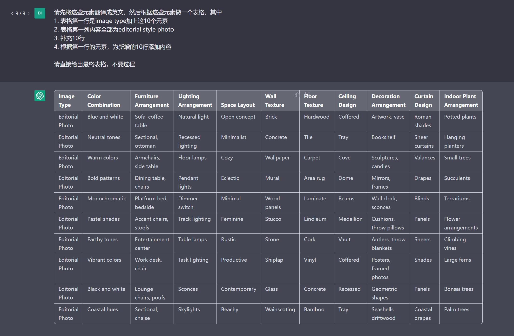
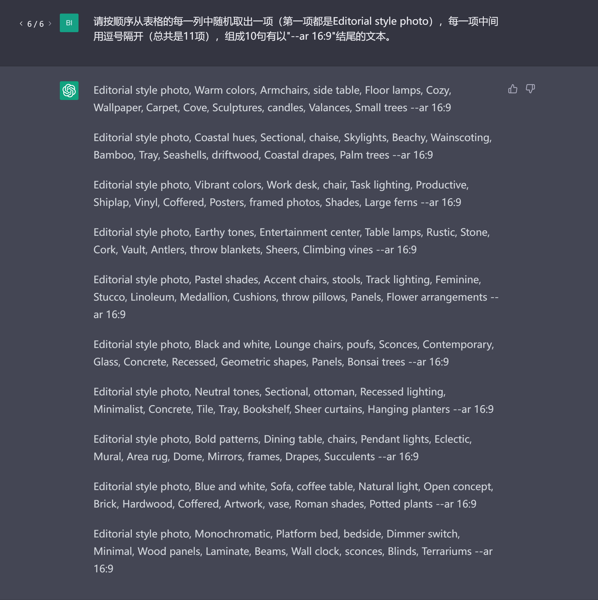

# 图片提示词生成
与chatGPT一同流行起来的还有众多图片生成工具，用户只需要输入文本，这些工具/服务就可以生成图片，即text to image。

所以直接影响生成图片质量的便是用户输入的文本/提示词，这里的提示词也称作prompt，为了与给chatGPT的prompt作出区分，这里我们将生成图片的提示词称作图片提示词（image prompt）。

之后会有一个章节专门来讲解image prompt的使用方法和技巧。在这部分我们更偏重的是如何利用chatGPT提高我们生成image prompt的效率。

如果我们想要生成室内设计效果图的图片[[2]](https://twitter.com/nickfloats/status/1635116674616791040?ref_src=twsrc%5Etfw%7Ctwcamp%5Etweetembed%7Ctwterm%5E1635116676978208769%7Ctwgr%5E310417aab2231e5a23cdcb566b080a4ca2481cc4%7Ctwcon%5Es2_&ref_url=https%3A%2F%2Fweirdwonderfulai.art%2Fgeneral%2Fusing-chatgpt-to-create-prompts-for-ai-art%2F)，但是不知道image prompt该从何写起，我们可以先让chatGPT拆解图片中的元素，

然后生成一个表格，这个头脑风暴式的表格可以给我们很多的参考组合，
剩下需要做的就是将这些词语组合到一起形成image prompt，交给Midjourney或者stable diffusion生成图片了。当然，我们也可以继续让chatGPT从表格中直接批量生成image prompt。

下面是Midjourney根据
>Editorial style photo, Coastal hues, Sectional, chaise, Skylights, Beachy, Wainscoting, Bamboo, Tray, Seashells, driftwood, Coastal drapes, Palm trees --ar 16:9

生成的图片。

Reference:

1. [tweet of Nick St. Pierre](https://twitter.com/nickfloats/status/1635116674616791040?ref_src=twsrc%5Etfw%7Ctwcamp%5Etweetembed%7Ctwterm%5E1635116676978208769%7Ctwgr%5E310417aab2231e5a23cdcb566b080a4ca2481cc4%7Ctwcon%5Es2_&ref_url=https%3A%2F%2Fweirdwonderfulai.art%2Fgeneral%2Fusing-chatgpt-to-create-prompts-for-ai-art%2F)