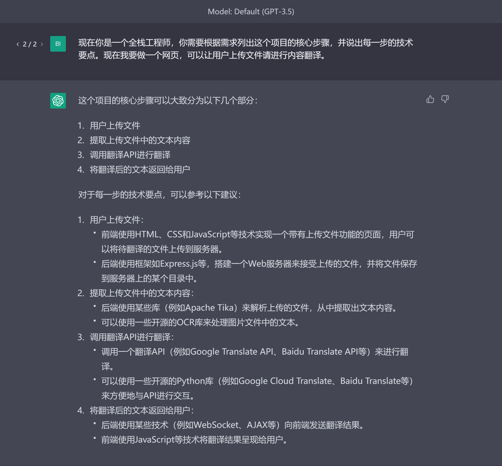
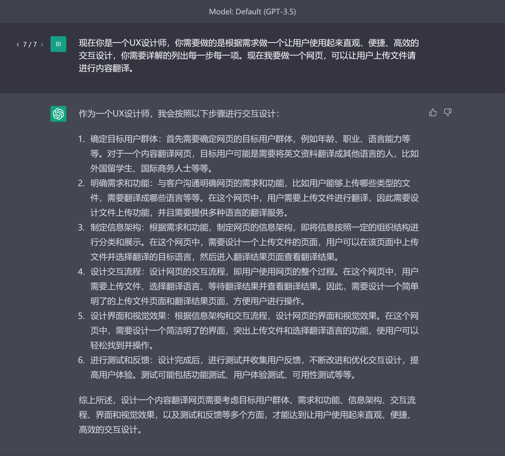

## 角色扮演
“角色扮演”是使用chatGPT过程中十分重要的一个技巧，除了让chatGPT可以以某种特定身份的说话方式说话之外，还可以使输出的内容更具有专业性。

我们可以先让chatGPT回答一个问题，

接着，加上角色扮演，让它重新输出文本，

可以看到在有角色扮演的“加持”后，内容在“文风”和关注侧重点上都有所不同。

针对同一个问题，不同的角色扮演也会得到不同专业角度的回答，

所以在chatGPT的使用中，善用角色扮演，是迭代和提高答案质量的关键。