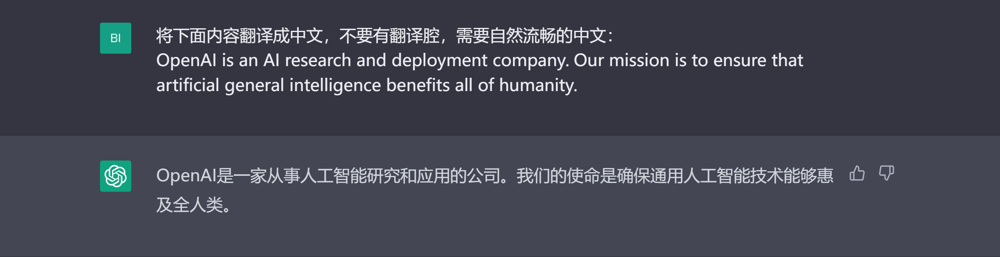
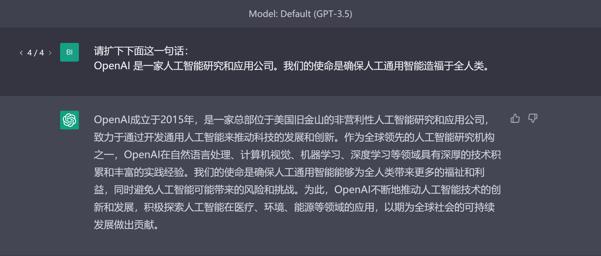
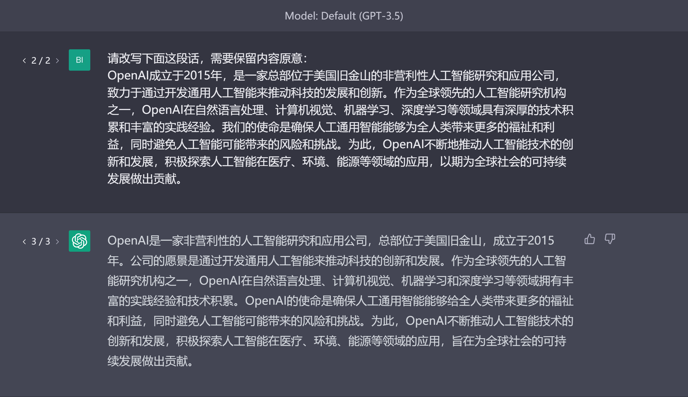
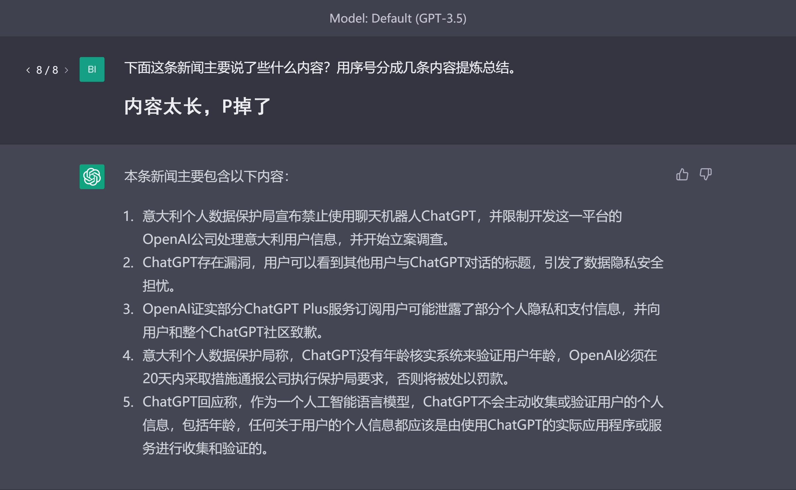
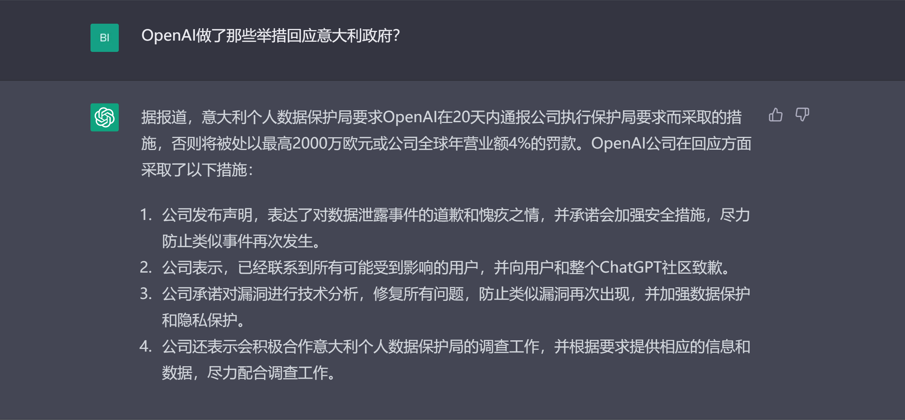
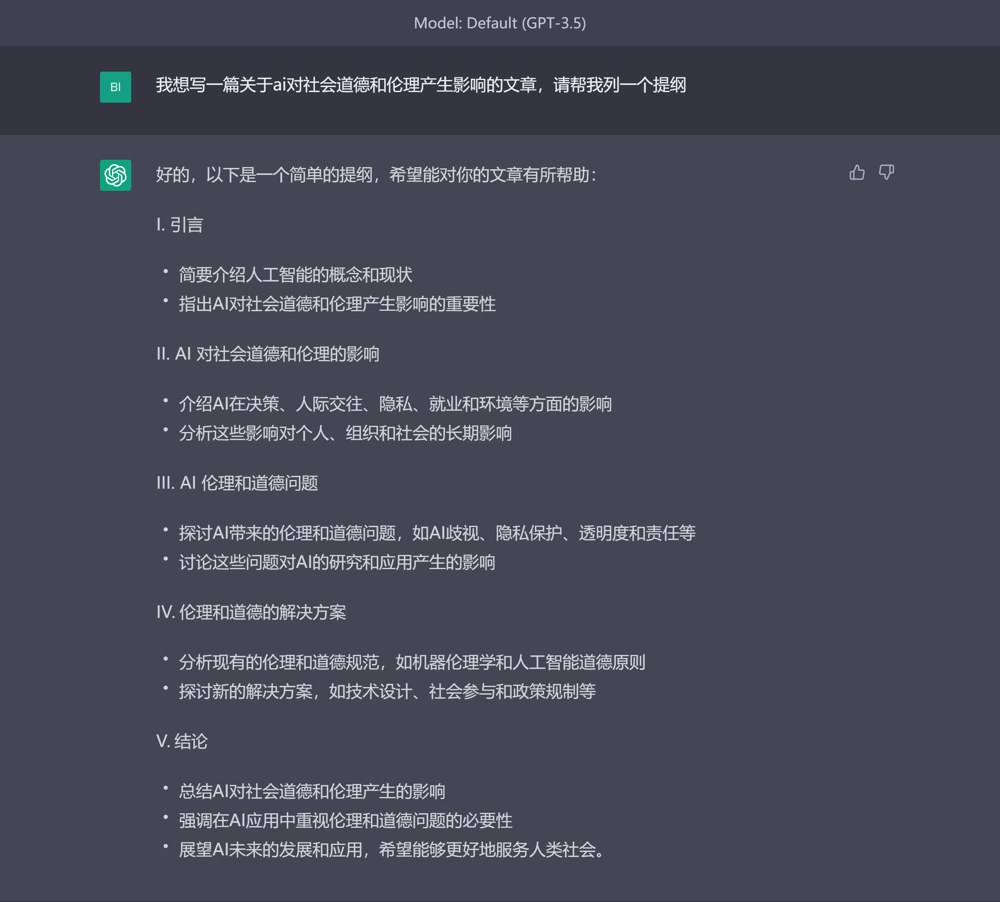
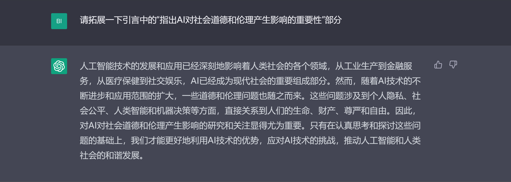

# 文字处理
除了简单的直接问答，我们也可以让chatGPT帮我们进行许多文字方面的处理工作。
## 翻译
最常见的应用之一就是翻译。传统的翻译工具我们需要将文本黏贴在指定框格中然后选择目标语言，在chatGPT中我们需要做的是“和它说我们需要翻译什么”，如果我们输入中文prompt+英文内容，一般情况下chatGPT就会返回中文；相反，如果输入prompt+中文内容，chatGPT就会返回英文，

当然，我们也可以直接输入具体的prompt。同时，你会发现上面的中文翻译结果有点生硬，我们可以提示chatGPT，翻译需要自然一点

## 扩写与改写
某些情况下，我们需要将一个句子的内容扩展得更加丰富，此时可以让chatGPT扩写，

除了扩写，我们也可以改写，在保留文本原意的基础上进行转述，

## 总结与问答
在某些阅读的时候，由于文本过长，而我们想快速了解文本的主要内容，此时可以使用chatGPT帮我们进行总结与提炼（下面例子原文过长，已裁去，可以点击查看[原文](#https://baijiahao.baidu.com/s?id=1761886603048134863&wfr=spider&for=pc)），

同时，我们也可以针对输入的文本内容，对chatGPT进行提问。

上述方法可以在许多使用场景提高我们的效率，比如paper阅读，专业报告阅读等等。
## 提纲与文段生成
最常见的情况是你想写一篇文章，告诉chatGPT你想写的主题内容，然后生成相应的提纲，

提纲生成之后，自然而然的我们可以根据提纲来生成具体的内容，比如提纲中的其中一点，

除了文章的提纲和文段生成，我们也可以将chatGPT应用在演讲稿、计划书等等文字任务上。