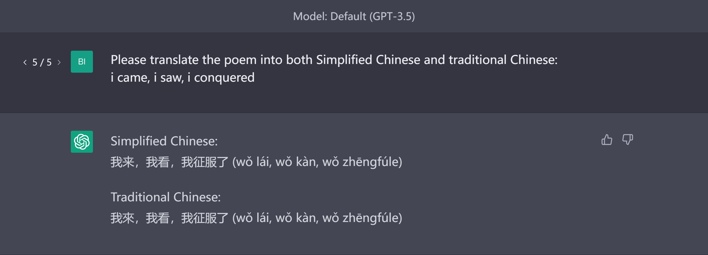
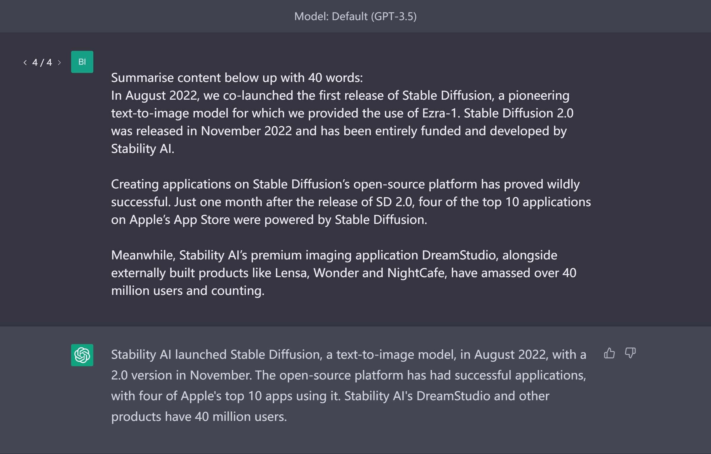
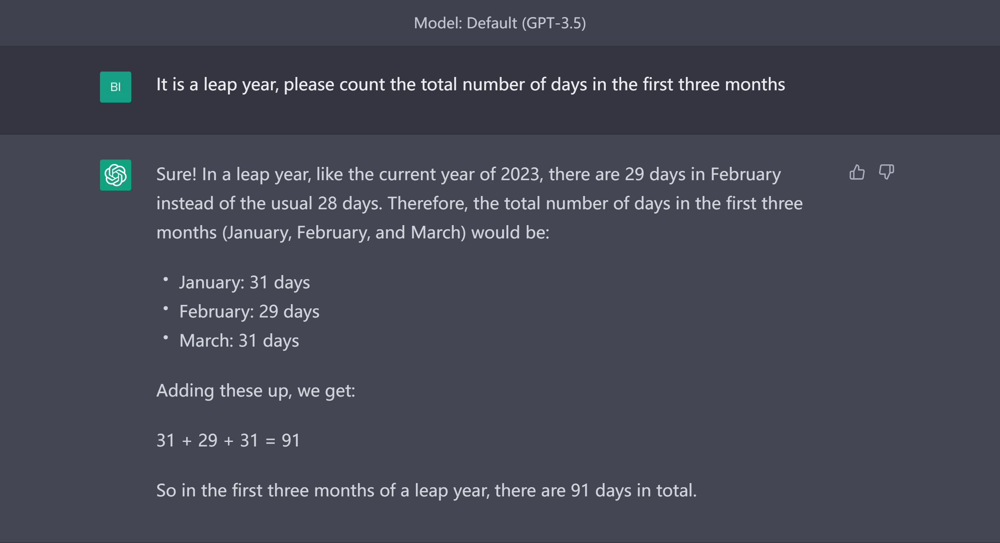

# 下达指令

下达指令是最简单和最经常被用到的提示词技巧。它指的是给大语言模型提供指令说明你想完成的任务，比如“写”、“翻译”、“概括”、“计算”、“提建议”，等等。

下面是使用了下达指令技巧的例子：
## 翻译

## 概括

## 计算

## 提建议

要注意的是，在上述示例中，不同的关键词会产生不同的结果。当我们在写提示词的时候，一定要测试不同的关键词、背景信息、数据，以写出效果良好的提示词。请记住写提示词是一件需要反复迭代的过程，你永远都需要通过实验来验证怎么写效果最好。