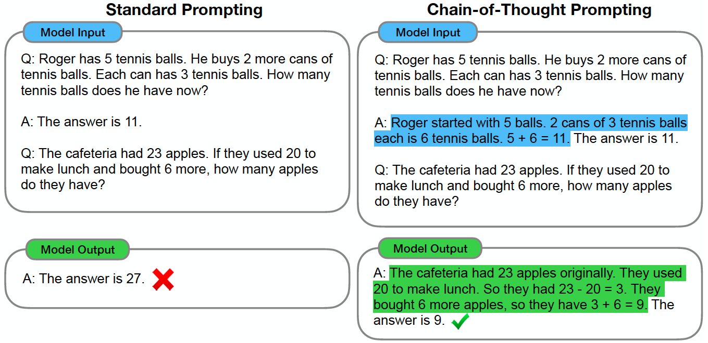
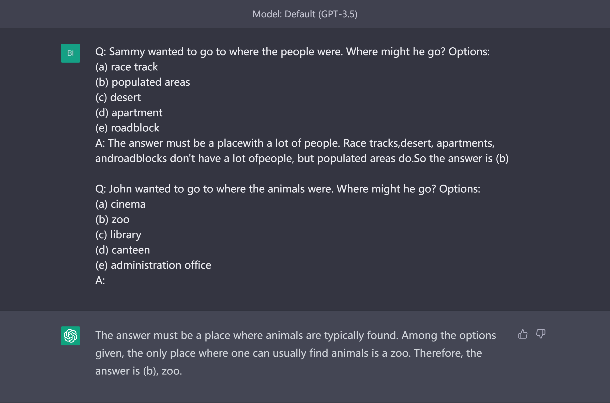
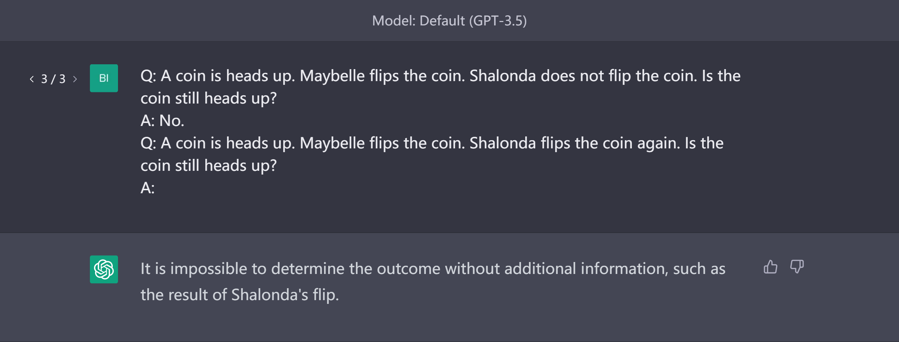
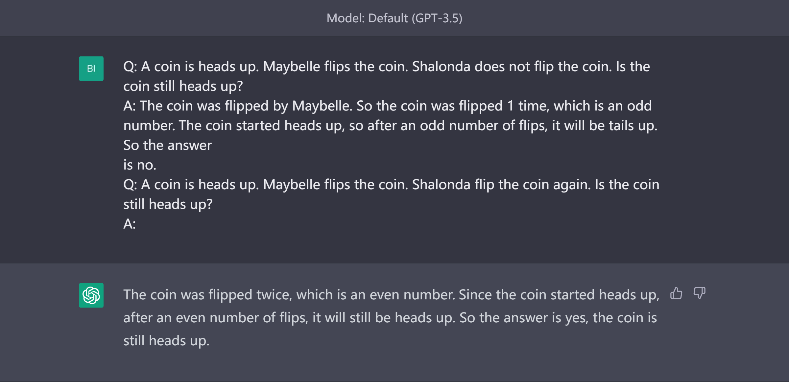
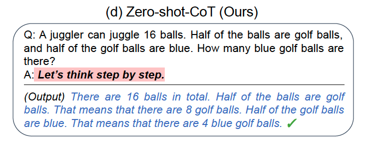
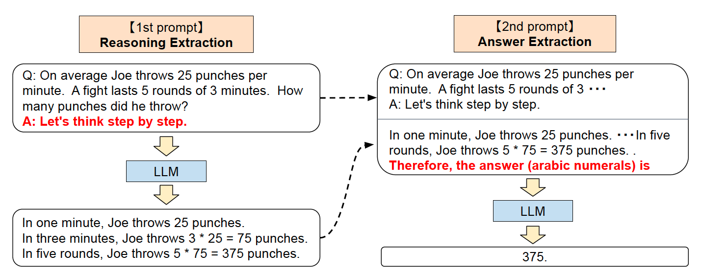
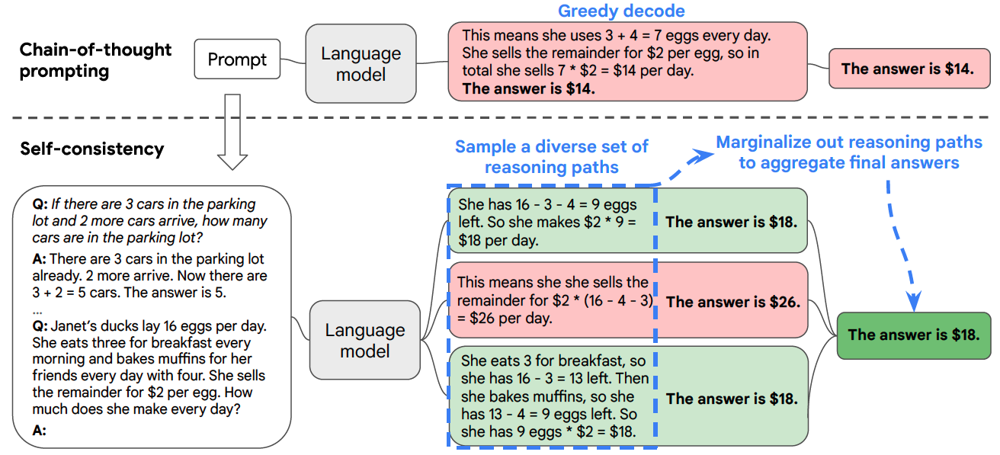

# Advanced Techniques

In this section, we introduce advanced techniques about prompt engineering.

Topics:

- [Chain of Thought](#Chain-of-Thought)
- [Zero-Shot Chain of Thought](#Zero-Shot-Chain-of-Thought)
- [Self-Consistency](#Self-Consistency)

## Chain of Thought

Chain of Thought (CoT) refers to a coherent series of intermediate reasoning steps that lead to the final answer for a problem. Including chain-of-thought reasoning in the exemplars for few-shot prompting can significantly improve the ability of large language models to perform complex reasoning.

### Tasks and Performance

Experiments has shown that chain-of-thought prompting improves performance on a range of arithmetic, commonsense, and symbolic reasoning tasks.

#### Arithmetic Task

#### Commonsense Task

#### Symbolic Task

### Limitations

Chain-of-thought prompting is an emergent ability of model scale. That is, chain-of-though prompting does not positively impact performance for small models, and only yields performance gains when used with models of ~100B parameters.

## Zero Shot Chain of Thought

Zero Shot Chain of Thought (Zero-shot CoT) prompting[2] is a follow-up to CoT prompting. The authors found that LLMs become decent zero-shot reasoners by simply adding "Let’s think step by step" before each answer.

How does Zero-shot-CoT work

### Examples

### Results
Experimental results demonstrate that Zero-shot-CoT outperforms LLMs' zero-shot performances on diverse benchmark reasoning tasks, including arithmetic, symbolic reasoning, and other logical reasoning tasks.

### Limitation
LLMs have shown to capture and amplify biases found in the training data. Prompting is a method that looks to take advantage of the patterns captured by language models conducive to various tasks, and therefore it has the same shortcomings.

## Self-Consistency

Self-consistency is a decoding strategy that improves language models' reasoning performance on complex tasks[3]. It replaces the greedy decoding strategy used in chain-of-thought prompting with a more diverse and flexible approach.

The idea behind self-consistency is that complex reasoning tasks often have multiple correct solutions, and people may arrive at these solutions through different reasoning paths. Rather than only considering the most likely path, self-consistency samples a diverse set of reasoning paths and then selects the most consistent answer. This approach allows for greater variability in human-like reasoning and improves performance on complex reasoning tasks.

The figure below illustrates the difference between Chain-of-thought prompting and self-consistency.

### Examples
*Image Placeholder*

### Results
Compared to chain-of-thought prompting, self-consistency significantly improves performance in arithmetic, commonsense, and symbolic reasoning on a variety of popular benchmarks. These include GSM8K (+17.9%), SVAMP (+11.0%), AQuA (+12.2%), StrategyQA (+6.4%), and ARC-challenge (+3.9%).

For some tasks (e.g. ANLI-R1, e-SNLI, RTE), adding chain-of-thought does hurt performance, but self-consistency is able to robustly boost the performance and outperform standard prompting.

### Limitation

One limitation of self-consistency is that it incurs more computation cost. In practice people can try a small number of paths (e.g., 5 or 10) as a starting point to realize most of the gains while not incurring too much cost, as in most cases the performance saturates quickly.

## Reference
1. Wei, J., Wang, X., Schuurmans, D., Bosma, M., Chi, E., Le, Q., & Zhou, D. (2022). Chain of thought prompting elicits reasoning in large language models. arXiv preprint arXiv:2201.11903.
2. Kojima, T., Gu, S. S., Reid, M., Matsuo, Y., & Iwasawa, Y. (2022). Large language models are zero-shot reasoners. arXiv preprint arXiv:2205.11916.
3. Wang, X., Wei, J., Schuurmans, D., Le, Q., Chi, E., & Zhou, D. (2022). Self-consistency improves chain of thought reasoning in language models. arXiv preprint arXiv:2203.11171.

[Previous Section (Basic Application)](prompting-basic-applications)

[Next Section (Reliability)](prompting-reliability)
